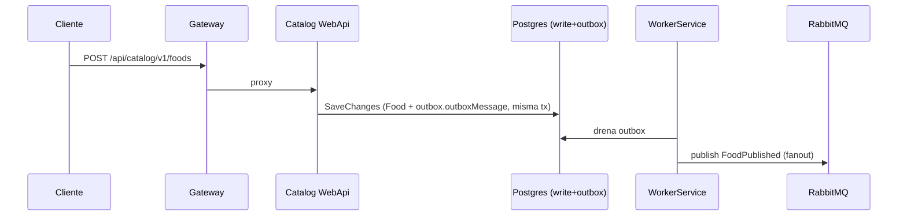
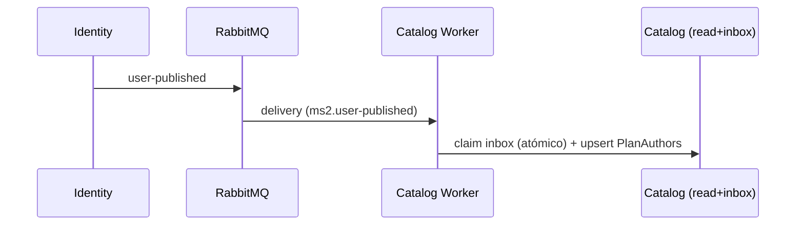
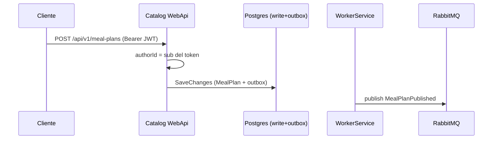

# Flujos — MS2 Catálogo

## Flujo 1: Crear alimento → evento FoodPublished

```mermaid
sequenceDiagram
  participant C as Cliente
  participant GW as Gateway
  participant API as Catalog WebApi
  participant DB as Postgres (write+outbox)
  participant W as WorkerService
  participant MQ as RabbitMQ
  C->>GW: POST /api/catalog/v1/foods
  GW->>API: proxy
  API->>DB: SaveChanges (Food + outbox.outboxMessage, misma tx)
  W->>DB: drena outbox
  W->>MQ: publish FoodPublished (fanout)
```

## Flujo 2: Identity crea usuario → PlanAuthors

```mermaid
sequenceDiagram
  participant ID as Identity
  participant MQ as RabbitMQ
  participant CAT as Catalog Worker
  participant DB as Catalog (read+inbox)
  ID->>MQ: user-published
  MQ->>CAT: delivery (ms2.user-published)
  CAT->>DB: claim inbox (atómico) + upsert PlanAuthors
```

## Flujo 3: Crear plan (author desde token)

```mermaid
sequenceDiagram
  participant C as Cliente
  participant API as Catalog WebApi
  participant DB as Postgres (write+outbox)
  participant W as WorkerService
  participant MQ as RabbitMQ
  C->>API: POST /api/v1/meal-plans (Bearer JWT)
  API->>API: authorId = sub del token
  API->>DB: SaveChanges (MealPlan + outbox)
  W->>MQ: publish MealPlanPublished
```
